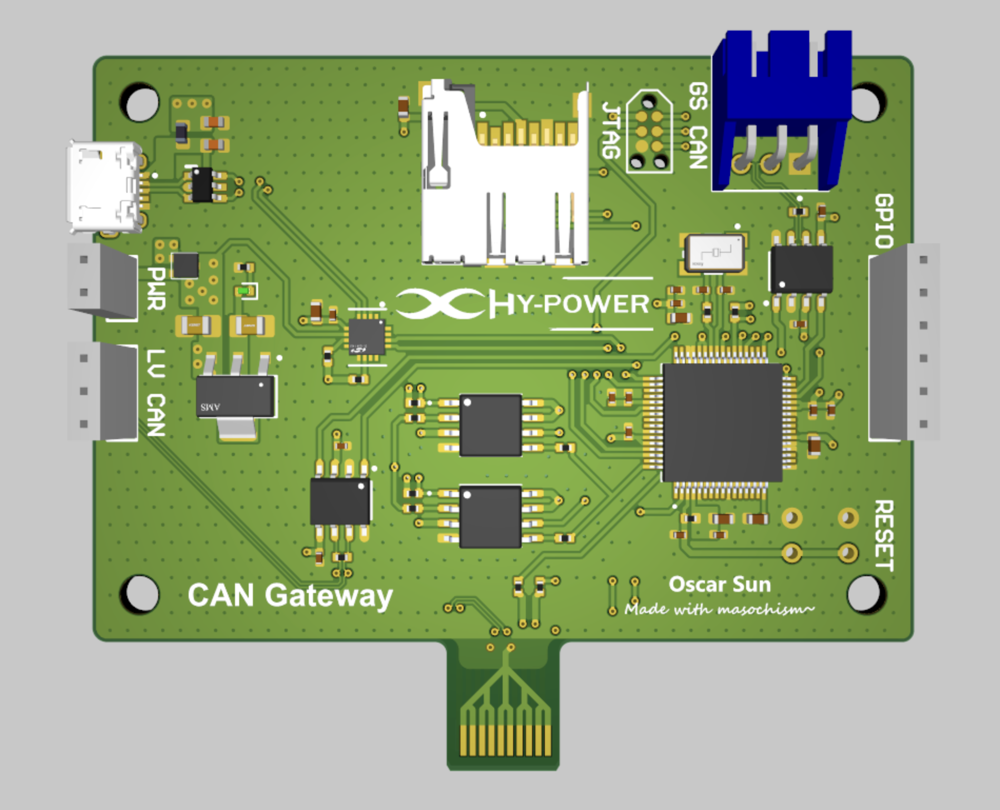

# CAN Gateway

The CAN Gateway is a common node on the Ground Station (GS) and Launch Vehicle (LV) CAN buses. During ground operations, it facilitates bi-directional communication across the two separate networks. During flight, direct communication between the buses is terminated and data is instead sent from LV CAN to the LoRa board for broadcasting. Additionally, the board functions as a data logger in flight. Data is stored to flash modules during flight and transferred to an SD card after parachute deployment.

Message priority in the CAN buses are assigned during CAN bus arbitration: messages with lower CAN IDs are prioritised and will always win arbitration. Once a message is received in a reception FIFO queue, the interrupt-triggered callback function is immediately called, re-transmitting the frame with a higher priority CAN ID. This combination of higher priority IDs and the configuration of interrupts prevent any buffer overflow/data loss. 

The CAN Gateway also monitors the *'heartbeat'* of all other connected boards, recording them offline if a period greater than some maximum threshold has elapsed after it detects the last message from a board. This threshold has provisionally been set to 1 second.

For more detailed information on CAN buses, arbitration, and heartbeats, visit these links:
- CAN Bus: A Beginners Guide Part 1 (https://www.youtube.com/watch?v=YBrU_eZM110)
- What is CAN Bus Arbitration? (https://www.youtube.com/watch?v=1eXSCazqnlQ)
- Automotive Communication Networks, Part II: Controller Area Network Bus (https://www.snapon.com/EN/US/Diagnostics/News-Center/CAN-Bus)

## Programable Components

|       Mfr. Part No.        | Data Sheet Link                                                                                                   | Description                    |
| :------------------------: | ----------------------------------------------------------------------------------------------------------------- | ------------------------------ |
|         F280049PMS         | https://www.ti.com/lit/ds/symlink/tms320f280049c.pdf?HQS=dis-dk-null-digikeymode-dsf-pf-null-wwe&ts=1768817872921 | Microcontroller unit (MCU)     |
| ABM3B-20.000MHZ-10-B-1-U-T | https://docs.rs-online.com/edf3/A700000008730747.pdf                                                              | 20MHz±10ppm Crystal oscillator |
|       MCP2562T-E/SN        | https://docs.rs-online.com/79e9/0900766b8166f58d.pdf                                                              | High-speed CAN transceiver     |
|    CP2102N-A02-GQFN20R     | https://docs.rs-online.com/eddc/A700000006416765.pdf                                                              | USB to UART bridge             |
|        W25Q128JVSIQ        | https://docs.rs-online.com/cdee/0900766b81622f85.pdf                                                              | 128MB flash with dual/quad SPI |
DC-3's CAN Gateway uses the TMS320F280049 / F280049PMS microcontroller from Texas Instruments with two internal 10MHz crystal oscillators. Additional components/features of microcontroller added to the board are listed as follows:
- An external 20MHz crystal oscillator
- 2 CAN bus ports (1Mbps bi-directional communication)
	- GS CAN via 3-pin connector
	- LV CAN via 20-pin connector / 3-pin header
- 2 serial peripheral interface (SPI) ports
	- 2x 128MB Flash
	- SD Card
- 2 UART-compatible serial communication interfaces (SCIs)
	- LoRa connection via 20-pin connector / micro-USB
	- Micro-USB
- JTAG
- 4x GPIO
- Manual reset button

## Connectivity and Debugging

|    Mfr. Part No.    | Data Sheet Link                                                                          | Description                              |
| :-----------------: | ---------------------------------------------------------------------------------------- | ---------------------------------------- |
|   10118194-0001LF   | https://docs.rs-online.com/1e89/0900766b815cae58.pdf                                     | Micro-USB receptacle                     |
| MEM2061-01-188-00-A | https://www.lcsc.com/datasheet/C5151738.pdf                                              | MicroSD card push-push connector         |
|      TC2030-NL      | https://www.tag-connect.com/wp-content/uploads/bsk-pdf-manager/2022/06/TC2030-MCP-NL.pdf | 6-Pin TC2030 connector for JTAG          |
|  CMP-1755-00006-1   | https://docs.rs-online.com/f25e/0900766b81357f2f.pdf                                     | Female GS CAN connector                  |
|     5-5530843-0     | https://docs.rs-online.com/89fc/0900766b815c13b9.pdf                                     | 20-pin edge connector                    |
|   CMP-002-00156-7   | N/A                                                                                      | 6-pin header for GPIO (Only 4 available) |
|   CMP-002-00160-6   | N/A                                                                                      | 3-pin header for reserve LV CAN          |
|   CMP-002-00161-7   | N/A                                                                                      | 2-pin header for reserve power           |
A micro-USB receptacle and JTAG connector are available on the board for debugging. 

During ground operations, GS CAN will be linked to the female connector which is in turn connected to a magnetic connector on the side of the rocket. There is no additional connectivity to GS CAN should this connector fail. However, communication to onboard systems will be maintained via LoRa.

The CAN Gateway is designed to interface with LV CAN and LoRa via a 20-pin edge connector that slots into the backplate board. If the edge connector fails, communication to LV CAN is maintained through a 3-pin header while communication to LoRa is maintained through a micro-USB connector

## Power Management and Reset

| Mfr. Part No. | Data Sheet Link                                      | Description                           |
| :-----------: | ---------------------------------------------------- | ------------------------------------- |
|  USBLC6-2SC6  | https://docs.rs-online.com/c890/0900766b807bd47e.pdf | TVS Diode Surface Mount               |
| PMEG2020CPASX | https://www.lcsc.com/datasheet/C552837.pdf           | 1 Pair common cathode schottky diode  |
|  AMS1117-3.3  | https://www.lcsc.com/datasheet/C347222.pdf           | 1A 3.3V Low-dropout voltage regulator |
| TSC016A04518A | https://www.lcsc.com/datasheet/C2888493.pdf          | Tactile switch (button) for MCU reset |
CAN Gateway requires a 5V power supply from either the micro USB port, 2-pin header, or the 20-pin edge connector. Part of this supply will be used by the CAN transceivers, while remaining power passes through a 3.3V low-dropout voltage regulator and is distributed across the board.